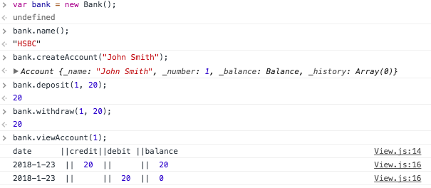

Bank Tech Test
=================

A Bank is a console application that allows a user to open a bank account in any instantiated bank, where a user can then add a deposit or withdraw money and print log/statement of transactions. On the statement a user can see the transaction type, amount, date and current balance.

Full requirements for the test can be found below. I have added a couple more functionalities to fully showcase Single Responsibility Principle methodology.

The application has been built using a TDD approach.


Requirements
-----

* You should be able to interact with the your code via a REPL like IRB or the JavaScript console.  (You don't need to implement a command line interface that takes input from STDIN.)
* Deposits, withdrawal.
* Account statement (date, amount, balance) printing.
* Data can be kept in memory (it doesn't need to be stored to a database or anything).

## Acceptance criteria

**Given** a client makes a deposit of 1000 on 10-01-2012
**And** a deposit of 2000 on 13-01-2012
**And** a withdrawal of 500 on 14-01-2012
**When** she prints her bank statement
**Then** she would see

```
date       || credit || debit   || balance
14/01/2012 ||        || 500.00  || 2500.00
13/01/2012 || 2000.00||         || 3000.00
10/01/2012 || 1000.00||         || 1000.00
```


Installation Steps
-----
1. Fork this repo, and clone to your local machine
2. Navigate to a project folder and open SpecRunner.html
3. See the list of passing tests. You can now interact with application using the console.


Bank :bank:
-----

```JavaScript

var bank = new Bank("Barclays");

```
You can create a bank with your preferred name by providing an optional argument. Otherwise the name will be set to a default "HSBS".


Account :a:
-----

```javascript
bank.createAccount("John Smith");
```

Once the bank was instantiated, a user can open an account in the bank by providing their name in the argument. The user will then be assigned a unique digit that represents an account number.


Deposit
-----

```javascript
bank.deposit(1, 100);
```
You can ask bank to deposit money into your account by providing your account number as the first argument, and the amount you wish to deposit as the second argument.


Withdrawal
-----

```javascript
bank.withdraw(1, 50);
```
You can withdraw money from your account by providing your account number as the first argument, and the amount you wish to withdraw as the second argument.

This instruction will fail and throw an error if:
- There is not enough money in your account :no_entry_sign:


Balance
-----
```javascript
bank.account(1).balance();
```
You can check balance of your account by providing your account number as the argument.

Statement :pencil:
-----
```javascript
bank.viewAccount(1);
```
You can view the log/statement of your transactions.


Running example
-----

